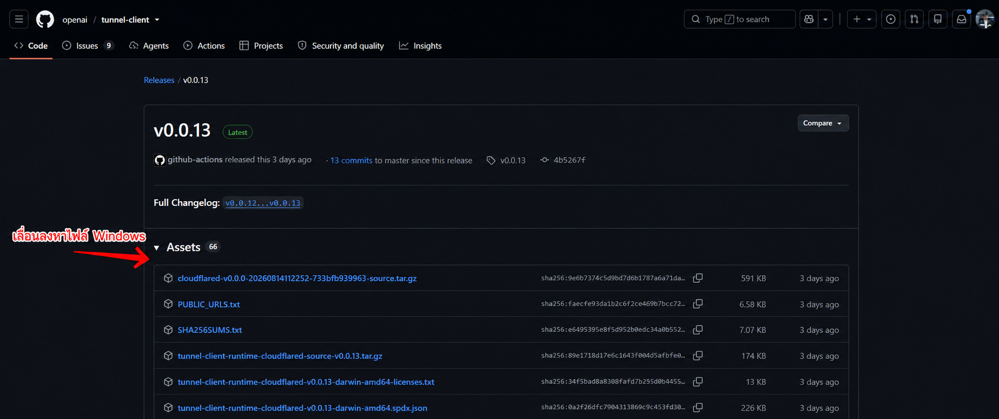
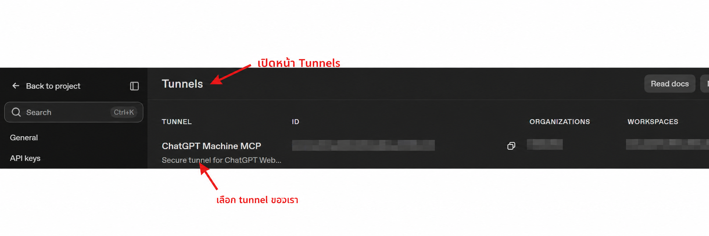

# ChatGPT Machine MCP

Use ChatGPT Web with a trusted local Windows machine through OpenAI Secure MCP Tunnel.

This README is the installation guide. For tools, architecture, transport, security, and contributor details, see the **[technical guide](https://jonusnattapong.github.io/ChatGPTMCP/)**.

## What you need

- Windows 10/11 or macOS (Apple Silicon / Intel)
- Node.js 20 or newer
- Git
- GitHub CLI (`gh`)
- A ChatGPT account that can use custom MCP apps/connectors
- An OpenAI Platform organization that can create Secure MCP Tunnels

## Setup

### 1. Clone and verify

```powershell
Set-Location D:\Projects\Github
gh repo clone JonusNattapong/ChatGPTMCP
Set-Location D:\Projects\Github\ChatGPTMCP
npm install
npm test
```

### 2. Download `tunnel-client`

The binary is deliberately not stored in Git.

```powershell
New-Item -ItemType Directory -Force tools\tunnel-client-v0.0.13 | Out-Null
gh release download v0.0.13 --repo openai/tunnel-client --pattern tunnel-client-v0.0.13-windows-amd64.zip --dir tools
Expand-Archive -LiteralPath tools\tunnel-client-v0.0.13-windows-amd64.zip -DestinationPath tools\tunnel-client-v0.0.13 -Force
Test-Path tools\tunnel-client-v0.0.13\tunnel-client.exe
```



### 3. Create a tunnel

Open OpenAI Platform → Organization settings → **Tunnels** → **Create tunnel**. Give it a name such as `ChatGPT Machine MCP`.



For a new tunnel, update `--tunnel-id` and `--organization-id` in [scripts/start-tunnel.ps1](scripts/start-tunnel.ps1). Do not put a runtime API key in source control.

### 4. Store the runtime key locally

```powershell
New-Item -ItemType Directory -Force .tunnel | Out-Null
$secureKey = Read-Host 'OpenAI tunnel runtime API key' -AsSecureString
ConvertFrom-SecureString $secureKey | Set-Content .tunnel\control-plane-api-key.dpapi
```

This encrypts the key with Windows DPAPI for the current Windows user. The `.tunnel` directory is ignored by Git.

### 5. Start the connection

Install/link the CLI once from the repository:

```powershell
npm install
npm link
```

Then use the operator CLI:

```powershell
chatgpt-local setup
chatgpt-local up
chatgpt-local status
```

Lifecycle commands:

```text
chatgpt-local up
chatgpt-local down
chatgpt-local restart
chatgpt-local status
chatgpt-local doctor
```

The underlying `scripts/` commands remain available for debugging, but normal operation should use `chatgpt-local`.

Continue only when the status reports:

```text
process_running : True
healthy         : True
ready           : True
```

Stop or restart the connection when it is not needed:

```powershell
chatgpt-local down      # or .\scripts\stop-tunnel.ps1
chatgpt-local restart   # detached refresh (logs to .tunnel/refresh-tunnel.log)
```

### 6. Add it in ChatGPT Web

Enable Developer mode in ChatGPT if required. Add the MCP app/connector for the tunnel, select `ChatGPT Machine MCP`, then refresh or reconnect its tools.

Test with:

```text
ใช้ machine_status ตรวจว่าเชื่อมต่อเครื่อง local สำเร็จ และอย่าแก้ไขไฟล์
```

After changing MCP code: run `npm run build`, stop/start the tunnel, and refresh the connector so ChatGPT receives the latest tool schema.


Useful local checks:

```powershell
chatgpt-local doctor          # same as node dist/index.js --doctor
node dist/index.js --doctor
node dist/index.js --check
# Preview all mutations without executing them:
node dist/index.js --root D:\Projects\Github --dry-run
```

When using local HTTP transport, the redacted recent-call viewer is available at `http://127.0.0.1:8787/ui`. If `MCP_HTTP_TOKEN` is enabled, the UI endpoints require the same Bearer authorization header.

## macOS / Ubuntu / WSL setup

The MCP server, file/process/Git tools, and tunnel lifecycle are supported on macOS, Ubuntu, and Ubuntu WSL. The Bash scripts use Keychain on macOS; Ubuntu/WSL use either `CONTROL_PLANE_API_KEY` for one launch or a local key file with mode `600`.

```bash
brew install node git gh
git clone https://github.com/JonusNattapong/ChatGPTMCP.git
cd ChatGPTMCP
npm install && npm test

# macOS: download darwin-arm64 on Apple Silicon, or darwin-amd64 on Intel.
mkdir -p tools/tunnel-client-v0.0.13
gh release download v0.0.13 --repo openai/tunnel-client --pattern "tunnel-client-v0.0.13-darwin-*.zip" --dir tools
unzip tools/tunnel-client-v0.0.13-darwin-*.zip -d tools/tunnel-client-v0.0.13
chmod +x tools/tunnel-client-v0.0.13/tunnel-client

# Enter the OpenAI runtime key at the prompt; it is stored in your Keychain.
security add-generic-password -U -a "$USER" -s chatgpt-machine-mcp-tunnel -w
export OPENAI_TUNNEL_ID="tunnel_..."
export OPENAI_ORGANIZATION_ID="org_..."
./scripts/start-tunnel.sh
./scripts/status-tunnel.sh
```

Use `./scripts/stop-tunnel.sh` to stop it. Download only the matching release archive for your architecture; do not extract both archives into the same directory.

On Ubuntu or WSL, use the matching `linux-amd64` or `linux-arm64` archive instead. Store the key without committing it:

```bash
mkdir -p .tunnel
umask 077
printf '%s' "$CONTROL_PLANE_API_KEY" > .tunnel/control-plane-api-key
chmod 600 .tunnel/control-plane-api-key
export OPENAI_TUNNEL_ID="tunnel_..."
export OPENAI_ORGANIZATION_ID="org_..."
./scripts/start-tunnel.sh
```

WSL runs in a Linux boundary: its MCP can operate WSL files and Linux processes. Run the Windows setup above if ChatGPT must operate native Windows applications, Windows services, or the Windows filesystem outside mounted drive paths.

## Automatic startup

The project does **not** start the tunnel automatically after Windows restarts. This is intentional because an active tunnel grants remote access with your Windows account's authority.

If you decide to enable auto-start, create a Windows Task Scheduler task that runs after you sign in and executes:

```powershell
pwsh.exe -NoProfile -ExecutionPolicy Bypass -File D:\Projects\Github\ChatGPTMCP\scripts\start-tunnel.ps1
```

Use **Run only when user is logged on** and **do not store a password**. Disable or delete that task when the machine should no longer be remotely reachable.

On macOS, use a per-user LaunchAgent only if you explicitly want the same persistent remote access after login. It should execute `scripts/start-tunnel.sh` with `OPENAI_TUNNEL_ID` and `OPENAI_ORGANIZATION_ID` set in its environment; the runtime key remains in Keychain. Do not use a system-wide daemon for this user-scoped setup.

## Help

- Check status: `./scripts/status-tunnel.ps1`
- Rebuild after source changes: `npm run build`
- Full architecture, safety model, tools, HTTP, and development: [technical guide](https://jonusnattapong.github.io/ChatGPTMCP/)
